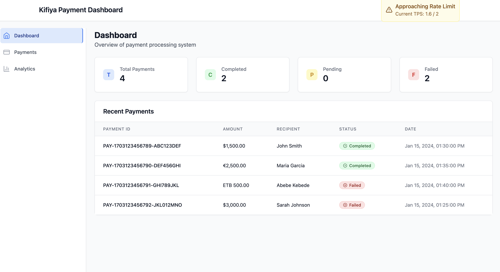
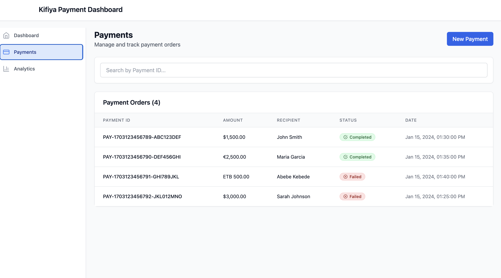
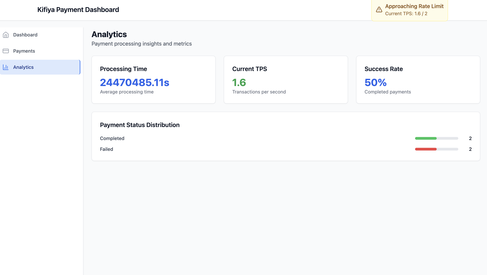

# Kifiya Payment Dashboard

A modern, responsive payment processing dashboard built with React, TypeScript, and Tailwind CSS. This application provides real-time monitoring and management capabilities for payment processing operations.

## Features

### Core Functionality
- **Real-time Payment Monitoring**: Live updates of payment statuses with automatic refresh
- **Payment Submission**: Form-based payment creation with validation
- **Status Tracking**: Visual status indicators for PENDING, IN_PROGRESS, COMPLETED, and FAILED payments
- **Search & Filtering**: Search payments by ID and filter by status
- **Rate Limit Awareness**: Real-time TPS monitoring with visual warnings
- **Analytics Dashboard**: Processing time metrics, success rates, and status distribution

### Technical Features
- **Responsive Design**: Mobile-first approach with adaptive layouts
- **Type Safety**: Full TypeScript implementation
- **State Management**: React Query for server state, Zustand for client state
- **Real-time Updates**: Automatic data refresh and optimistic updates
- **Error Handling**: Comprehensive error states and retry mechanisms
- **Performance**: Optimized rendering and efficient data fetching

## Screenshots

### Dashboard Overview


The main dashboard provides an overview of payment processing with key statistics cards and recent payment transactions. Features include:
- Real-time payment statistics (Total, Completed, Pending, Failed)
- Recent payments table with status indicators
- Rate limit warnings for system monitoring

### Payments Management


The payments page allows users to manage and track payment orders with:
- Payment submission form with validation
- Searchable payment table
- Status filtering and management
- Real-time status updates

### Analytics & Metrics


The analytics page provides detailed insights into payment processing performance:
- Processing time metrics
- Current TPS (Transactions Per Second) monitoring
- Success rate calculations
- Payment status distribution charts


## Technology Stack

- **Frontend**: React 18 with TypeScript
- **Build Tool**: Vite
- **Styling**: Tailwind CSS
- **State Management**: TanStack Query (React Query) + Zustand
- **Forms**: React Hook Form with Zod validation
- **Icons**: Lucide React
- **Charts**: Recharts (for analytics)

## Project Structure

```
src/
├── components/
│   ├── common/          # Reusable UI components
│   ├── forms/           # Form components
│   ├── layout/          # Layout components
│   └── analytics/       # Chart and analytics components
├── hooks/               # Custom React hooks
├── pages/               # Page components
├── services/            # API and data services
├── types/               # TypeScript type definitions
└── utils/               # Utility functions and constants
```

## Getting Started

### Prerequisites
- Node.js 18+ 
- npm or yarn

### Installation

1. Clone the repository:
```bash
git clone <repository-url>
cd payment
```

2. Install dependencies:
```bash
npm install
```

3. Start the development server:
```bash
npm run dev
```

4. Open your browser and navigate to `http://localhost:5173`

### Available Scripts

- `npm run dev` - Start development server
- `npm run build` - Build for production
- `npm run preview` - Preview production build
- `npm run lint` - Run ESLint

## Key Components

### Dashboard
- Overview cards showing key metrics
- Recent payments table
- Real-time status updates

### Payments Page
- Payment submission form
- Searchable payment table
- Status filtering
- Retry functionality for failed payments

### Analytics Page
- Processing time metrics
- TPS monitoring
- Status distribution charts
- Success rate calculations

## Mock Data & Simulation

The application includes realistic mock data and simulation features:

- **Payment Status Changes**: Automatic status transitions every 8 seconds
- **TPS Fluctuations**: Realistic TPS variations every 10 seconds
- **Processing Times**: Simulated processing delays and completion times
- **Error Scenarios**: Mock failure conditions and error messages

## Design Decisions

### Architecture
- **Component-Based**: Modular, reusable components
- **Hook-Based**: Custom hooks for data fetching and state management
- **Type-Safe**: Full TypeScript implementation for better developer experience

### User Experience
- **Real-time Updates**: Live data without manual refresh
- **Responsive Design**: Works seamlessly across all device sizes
- **Loading States**: Clear feedback during data fetching
- **Error Handling**: Graceful error states with retry options

### Performance
- **Optimistic Updates**: Immediate UI feedback for user actions
- **Efficient Re-renders**: Minimal component updates
- **Caching**: Smart data caching with React Query

## Future Enhancements

- **Real API Integration**: Replace mock data with actual payment APIs
- **Advanced Analytics**: More detailed charts and metrics
- **User Authentication**: Role-based access control
- **Notifications**: Real-time alerts and notifications
- **Export Features**: Data export capabilities
- **Advanced Filtering**: More sophisticated search and filter options

## Contributing

1. Fork the repository
2. Create a feature branch
3. Make your changes
4. Add tests if applicable
5. Submit a pull request

## License

This project is part of the Kifiya Payment Dashboard Take-Home Challenge. 